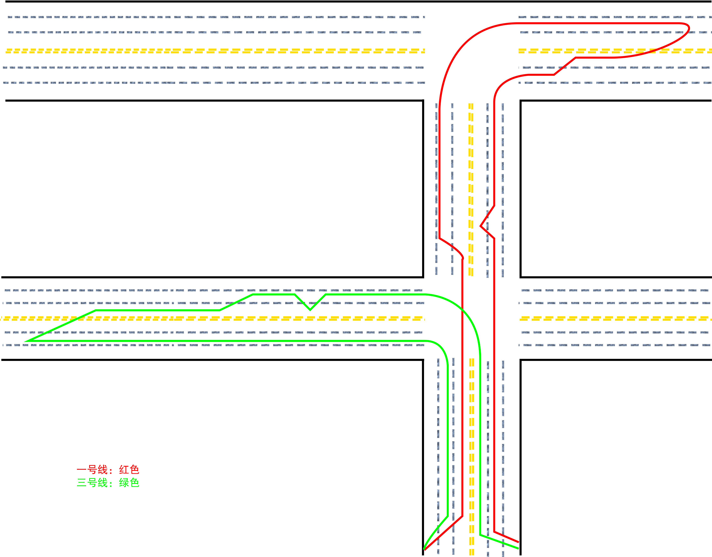

# 2017.07

## 考驾照

### 上车准备
* 看车是否熄火。如果熄火。打火。
* 调整座椅。
* 松手刹，看车是否溜车。等车停稳，拉手刹。
* 拨近光灯
* 听语音上车准备。左右看，开车门下车。围着车转一圈，按4-5个感应器。开车门，开所有灯光，上车

### 夜考
+ 听语音
    - 近光灯： 近距离跟车、照明良好、有路灯
    - 远光灯： 照明不好，没有路灯
    - 双闪： 当语音提示需要近光灯，而灯就在近光灯时，可以双闪。
    - 紧急报警灯：临时路边停车。开启紧急报警灯是需要关闭大灯（就是关闭所有灯光）
* 夜考完成，注意关闭所有灯光。 
* 如果最后一题是紧急报警灯。需要关掉紧急报警灯。

### 准备起步
* 带安全带
* 陀螺仪
* 转向灯
* 按喇叭(3s以上)
* 挂一档
* 松手刹
* 左右看旁边和后视镜情况
* 起步

### 路考
* 起步后，一切听语音
* 凡是听到“通过**”，需要观察左右情况，速度不允许超过30迈
* 凡是需要转向灯的地方(超车、行驶原车道、变更车道、路口转弯、掉头)需要先打开相应的转向灯，看左右后视镜，3s不动方向盘，后变更到相应的车道。
* 加减挡： 二个挡位之间，必须在5s内完成。 3档换2档，要慢抬离合。<4-3-2-3>

### 靠边停车
* 听到“靠边停车”后，打开右转向灯，左右看后视镜，3s不动方向盘，确认安全后靠边停车
* 挂空挡
* 拉手刹
* 熄火
* 左右看，开车门
* 关车门
* 安全带，陀螺仪
* 左右看，开车门
* 下车
* 完
