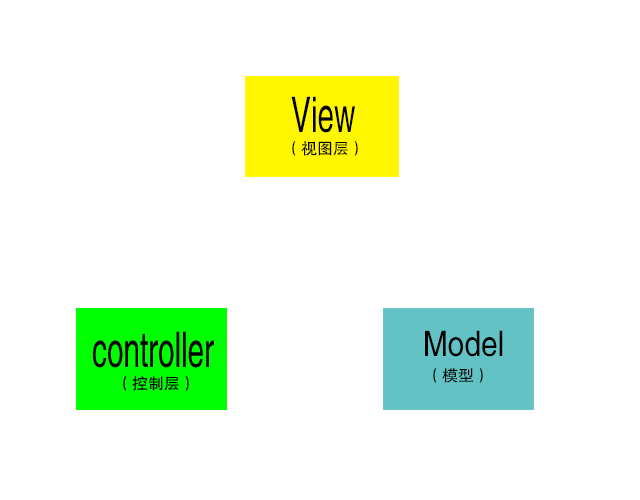
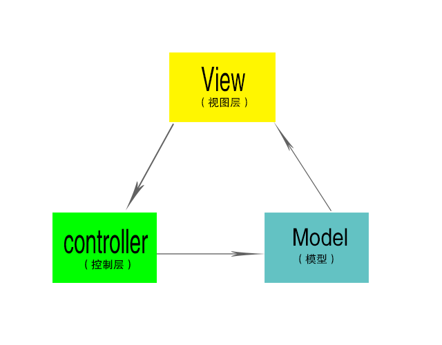
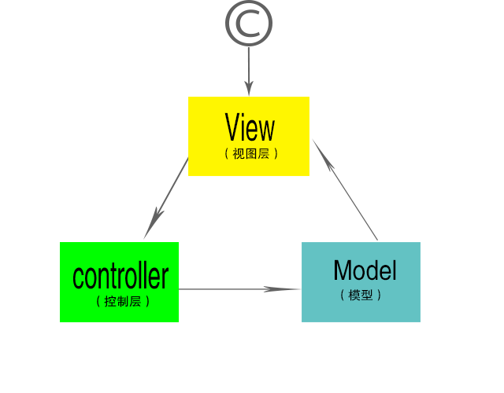
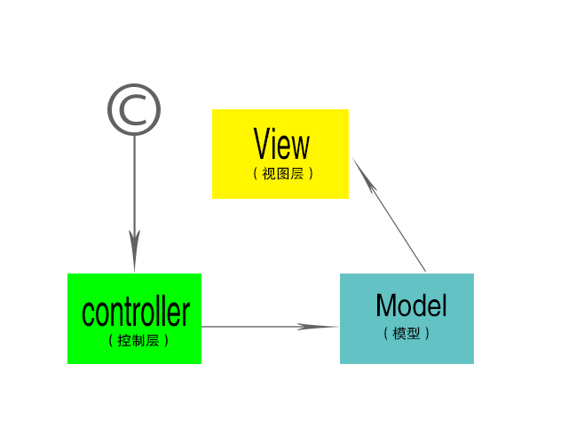
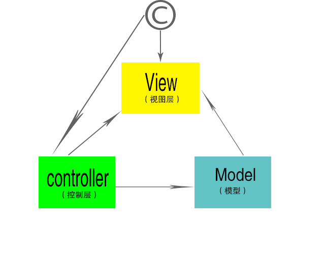
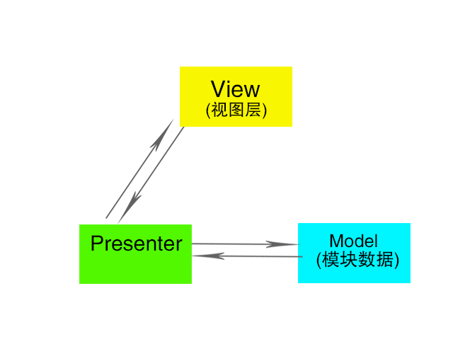
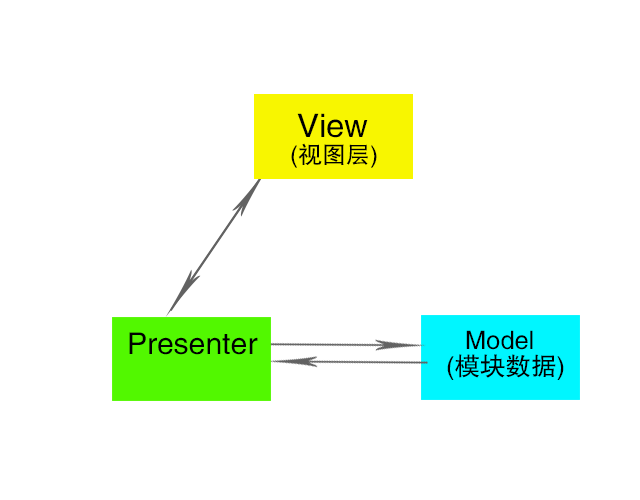

# MVC(Model-view-Controller)

<!-- 
http://www.ruanyifeng.com/blog/2015/02/mvcmvp_mvvm.html
 -->

* 视图（View）：用户界面。
* 控制器（Controller）：业务逻辑
* 模型（Model）：数据保存

组件通信如下。

1. View(视图层) 传送指令到 Controller(控制业务逻辑层)
2. Controller(控制业务逻辑层) 完成业务逻辑后，要求 Model(模型-数据存储) 改变状态
3. Model(模型-数据存储) 将新的数据发送到 View(视图层)，用户得到反馈

流程---> 
View(视图层)触发事件-->Controller(控制业务逻辑层)处理事件业务逻辑-->未知更新了Model-->Model返回数据给View

**所有通信都是单向的。**

## 互动模式

接受用户指令时，MVC 可以分成两种方式。一种是通过 View(视图层) 接受指令，传递给 Controller(业务逻辑)。

* 用户在View(视图层)，操作DOM.发送请求Controller(业务逻辑层),改变Model(数据存储)。从而在View展示。

另一种是直接通过controller接受指令。

## **实例：Backbone**

实际项目往往采用更灵活的方式，以 Backbone.js 为例。

1. 用户可以向 View 发送指令（DOM 事件），再由 View 直接要求 Model 改变状态。
2. 用户也可以直接向 Controller 发送指令（改变 URL 触发 hashChange 事件），再由 Controller 发送给 View。
3. Controller 非常薄，只起到路由的作用，而 View 非常厚，业务逻辑都部署在 View。所以，Backbone 索性取消了 Controller，只保留一个 Router（路由器） 。

## MVP(Model-View-Presenter)

MVP 模式将 Controller 改名为 Presenter，同时改变了通信方向。

1. 各部分之间的通信，都是双向的。
2. View 与 Model 不发生联系，都通过 Presenter 传递。
3. View 非常薄，不部署任何业务逻辑，称为"被动视图"（Passive View），即没有任何主动性，而 Presenter非常厚，所有逻辑都部署在那里。

## MVVM(Model-View-ViewModel)

MVVM 模式将 Presenter 改名为 ViewModel，基本上与 MVP 模式完全一致。

唯一的区别是，它采用双向绑定（data-binding）：View的变动，自动反映在 ViewModel，反之亦然。`Angular` 、`Vue` 、`React` 、 `Ember` 都采用这种模式。

**总结**

1. 在MVC，当你有变化的时候你需要同时维护三个对象和三个交互，这显然让事情复杂化了。
2. 随着需求变得庞大的时候，需求变化也变得频繁，这是一个出现了无数次以后也将会出现无数的无数次的一个问题，所以它需要一个解决方案，哪怕它不一定能被解决。

3. MVP：切断的View和Model的联系，让View只和Presenter（原Controller）交互，减少在需求变化中需要维护的对象的数量。
4. MVP定义了Presenter和View之间的接口，让一些可以根据已有的接口协议去各自分别独立开发，以此去解决界面需求变化频繁的问题。

5. MVVM： ViewModel大致上就是MVP的Presenter和MVC的Controller了，而View和ViewModel间没有了MVP的界面接口，而是直接交互，用数据“绑定”的形式让数据更新的事件不需要开发人员手动去编写特殊用例，而是自动地双向同步。
6. 比起MVP，MVVM不仅简化了业务与界面的依赖关系，还优化了数据频繁更新的解决方案，甚至可以说提供了一种有效的解决模式。