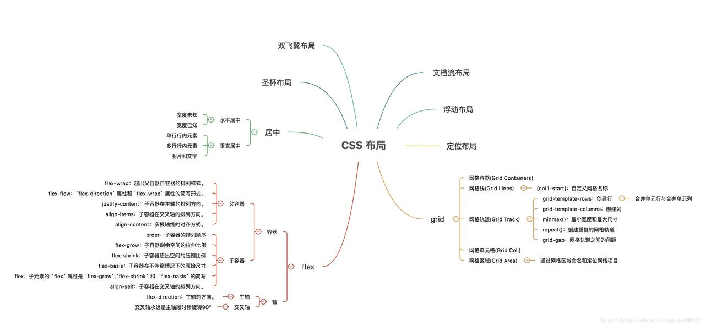
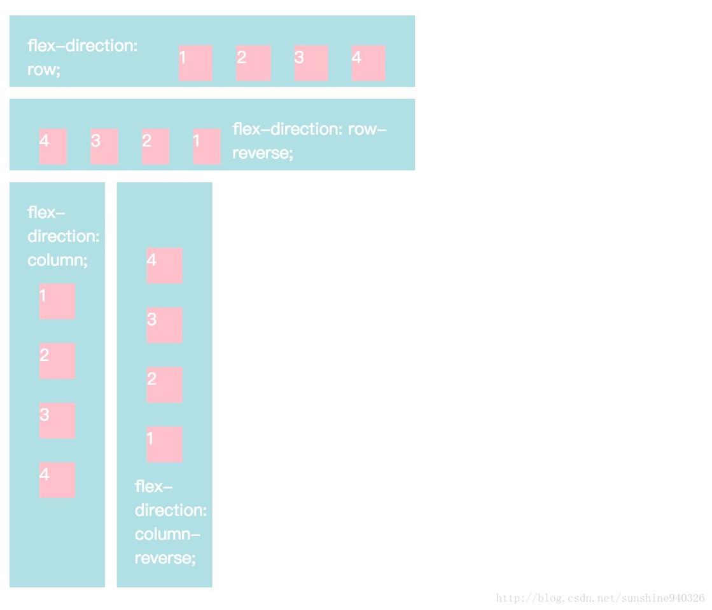
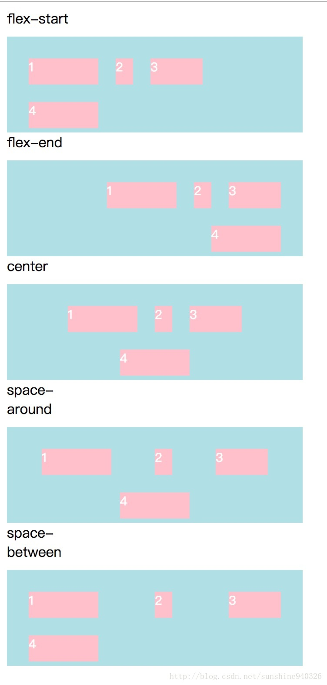
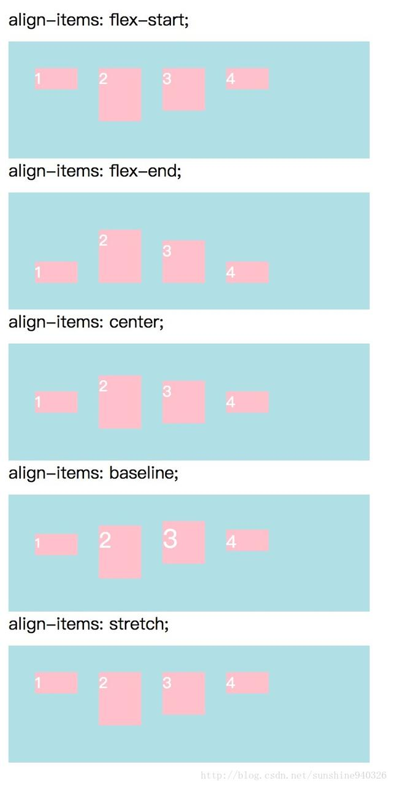
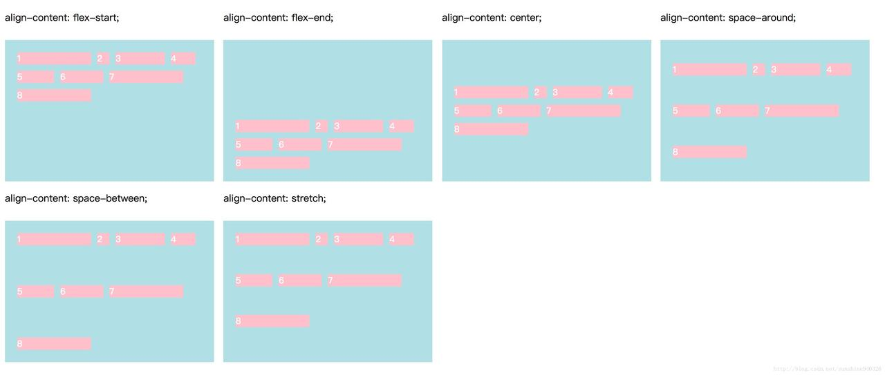
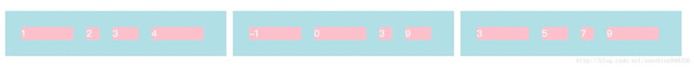
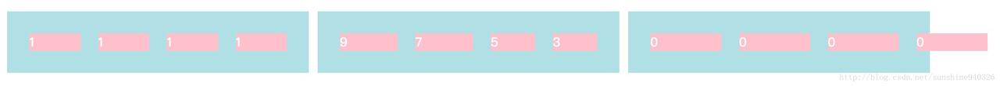
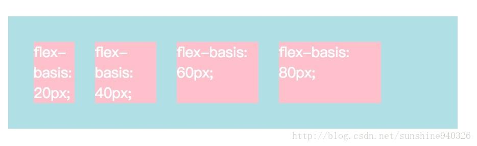
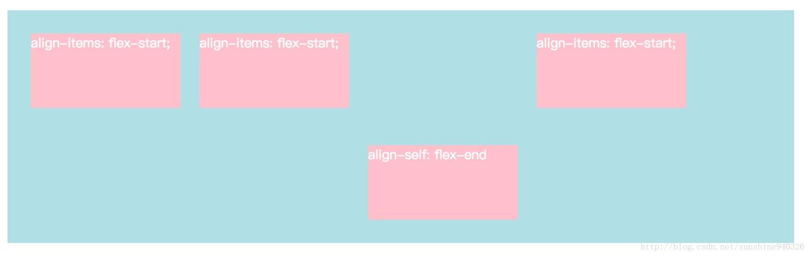

# CSS 常见布局方法

<!-- https://juejin.im/post/599970f4518825243a78b9d5?utm_source=gold_browser_extension -->



- 传统盒模型布局方式
  - 文档流布局
  - 浮动布局
  - 定位布局
- flex 布局
  - display: flex;
    - **注意，设为 Flex 布局以后，子元素的 float、clear 和 vertical-align 属性将失效。**
  - 在 flex 中，最核心的概念就是容器和轴，所有的属性都是围绕容器和轴设置的。其中，容器分为父容器和子容器。轴分为主轴和交叉轴（主轴默认为水平方向，方向向右，交叉轴为主轴顺时针旋转 90°）。
  - 在使用 flex 的元素中，默认存在两根轴：水平的主轴（main axis）和垂直的交叉轴（cross axis）
  - 主轴开始的位置称为 main start，主轴结束的位置称为 main end。
  - 同理，交叉轴开始的位置称为 cross start，交叉轴结束的位置称为 cross end。
  - 在使用 flex 的子元素中，占据的主轴空间叫做 main size，占据的交叉轴空间叫做 cross size。


- 父容器属性

  - `flex-direction`：主轴的方向。
    - `flex-direction` 属性决定主轴的方向（主轴的方向不一定是水平的，这个属性就是设置主轴的方向，主轴默认是水平方向，从左至右，如果主轴方向设置完毕，那么交叉轴就不需要设置，交叉轴永远是主轴顺时针旋转 90°）。
    ```
    .ele {
        flex-direction: row;                // 默认值，主轴为水平方向，起点在左端。
        flex-direction: row-reverse;        // 主轴为水平方向，起点在右端。
        flex-direction: column;             // 主轴为垂直方向，起点在上。
        flex-direction: column-reverse;     // 主轴为垂直方向，起点在下。
        }
    ```
    
  - `flex-wrap`：超出父容器自容器的排列样式。 - `flex-wrap` 属性决定子容器如果在一条轴线排不下时，如何换行。
    `.ele { flex-wrap: nowrap; // 默认，不换行 flex-wrap: wrap; // 换行，第一行在上方。 flex-wrap: wrap-reverse // 换行，第一行在下方。 }`
    
  - `flex-flow`：`flex-direction` 属性和 `flex-wrap` 属性的简写形式。

    - `justify-content` 属性定义了子容器在主轴上的对齐方式。

    ```
    .ele{
        justify-content: flex-start;      // 默认，左对齐
        justify-content: flex-end;        // 右对齐
        justify-content: center;          // 居中
        justify-content: space-between;   // 两端对齐，项目之间的间隔都相等。
        justify-content: space-around;    // 每个项目两侧的间隔相等。所以，项目之间的间隔比项目与边框的间隔大一倍。
    }
    ```

    

    - `flex-flow` 属性是 `flex-direction` 属性和 `flex-wrap` 属性的简写形式，默认值为 `row nowrap`。

    ```
    .ele {
        flex-flow: <flex-direction> || <flex-wrap>;
        }
    ```

  - `justify-content`：子容器在主轴的排列方向。
  - `align-items`：子容器在交叉轴的排列方向。
    - `align-items`属性定义自容器在交叉轴上如何对齐。具体的对齐方式与交叉轴的方向有关，下面假设交叉轴从上到下。
    ```
    .ele{
        align-items: flex-start;    // 交叉轴的起点对齐。
        align-items: flex-end;      // 交叉轴的终点对齐。
        align-items: center;        // 交叉轴的中点对齐。
        align-items: baseline;      // 项目的第一行文字的基线对齐。
        align-items: stretch;       // 默认，如果项目未设置高度或设为auto，将占满整个容器的高度。
    }
    ```
    
  - `align-content`：多根轴线的对齐方式。
    - `align-content` 属性定义了多根轴线的对齐方式。如果项目只有一根轴线，该属性不起作用。
    ```
    .ele{
        align-content: flex-start;   // 与交叉轴的起点对齐
        align-content; flex-end;     // 与交叉轴的终点对齐。
        align-content: center;       // 与交叉轴的中点对齐。
        align-content: space-between;// 与交叉轴两端对齐，轴线之间的间隔平均分布。
        align-content: space-around; // 每根轴线两侧的间隔都相等。所以，轴线之间的间隔比轴线与边框的间隔大一倍。
        align-content: stretch;     // 默认 轴线占满整个交叉轴。
    }
    ```
    

## 子容器属性

- `order`：子容器的排列顺序
- `flex-grow`：子容器剩余空间的拉伸比例
- `flex-shrink`：子容器超出空间的压缩比例
- `flex-basis`：自容器在不伸缩情况下的原始尺寸
- `flex`：子元素的 `flex` 属性是 `flex-grow`,`flex-shrink` 和 `flex-basis` 的简写`align-self`.

### `order`

- `order` 属性定义项目的排列顺序。数值越小，排列越靠前，默认为 0。

```
.ele{
    order:num;
}
```



### `flex-grow`

- `flex-grow` 属性定义子容器的伸缩比例。按照该比例给子容器分配空间。

```
.ele{
    flex-grow:<number>
}
```


### `flex-shrink` 属性

- `flex-shrink` 属性定义了子容器弹性收缩的比例。如图，超出的部分按 1:2 的比例从给子容器中减去。**此属性要生效，父容器的 `flex-wrap` 属性要设置为 nowrap**

```
.ele{
    flex-shrink: <number>; /* default 0 */
}
```



### `flex-basis` 属性

- `flex-basis` 属性定义了自容器在不伸缩情况下的原始尺寸，主轴为横向时代表宽度，主轴为纵向时代表高度。

```
.ele{
    flex-basis: <length> | auto; /* default auto */
}
```



### `flex`属性

- 子元素的 `flex` 属性是 `flex-grow`,`flex-shrink` 和 `flex-basis` 的简写，默认值为 0 1 auto。后两个属性可选。该属性有两个快捷值：auto (1 1 auto) 和 none (0 0 auto)。

### `align-self` 属性

- 子容器的 `align-self` 属性允许单个项目有与其他项目不一样的对齐方式，可覆盖父容器 `align-items` 属性。默认值为 `auto`，表示继承父元素的 `align-items`属性，如果没有父元素，则等同于 `stretch`。

```
.ele{
    align-self: auto;             // 继承父元素的 align-items 属性
    align-self: flex-start;       // 交叉轴的起点对齐。
    align-self: flex-end;         // 交叉轴的终点对齐。
    align-self: center;           // 交叉轴的中点对齐。
    align-self: baseline;         // 项目的第一行文字的基线对齐。
    align-self: stretch;          // 默认，如果项目未设置高度或设为auto，将占满整个容器的高度。
}
```


