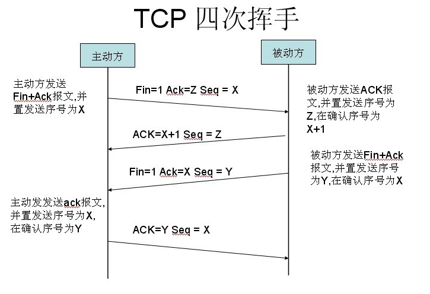

# http

+ 请求方法
    - OPTION : 用于获取资源支持的所有 HTTP 方法
    - HEAD : 用于只获取请求某个资源返回的头信息
    - GET : 用于从服务器获取资源信息
    - POST : 用于创建新资源
    - PUT : 用于完整的替换资源或者创建指定身份的资源
    - DELETE : 用于删除某个资源
    - PATCH : 用于局部更新资源
+ 状态码
    + 请求成功
        - 200 : 求执行成功并返回相应数据
        - 201 : 创建成功并返回相应资源数据
        - 202 : 接受请求，但无法立即完成创建行为
        - 204 : 请求执行成功，不返回相应资源数据
    + 重定向
        - 301 : 被请求的资源已永久移动到新位置
        - 302 : 请求的资源现在临时从不同的 URI 响应请求
        - 303 : 对应当前请求的响应可以在另一个 URI 上被找到，客户端应该使用 GET 方法进行请求
        - 307 : 对应当前请求的响应可以在另一个 URI 上被找到，客户端应该保持原有的请求方法进行请求
    + 条件请求
        - 304 : 资源自从上次请求后没有再次发生变化，主要使用场景在于实现数据缓存
        - 409 : 请求操作和资源的当前状态存在冲突。主要使用场景在于实现并发控制
        - 412 : 服务器在验证在请求的头字段中给出先决条件时，没能满足其中的一个或多个。主要使用场景在于实现并发控制

    + 客户端错误
        - 400 : 请求体包含语法错误
        - 401 : 需要验证用户身份
        - 403 : 服务器拒绝执行
        - 404 : 找不到目标资源
        - 405 : 不允许执行目标方法，响应中应该带有 Allow 头，内容为对该资源有效的 HTTP 方法
        - 406 : 服务器不支持客户端请求的内容格式
        - 410 : 被请求的资源已被删除
        - 413 : POST 或者 PUT 请求的消息实体过大
        - 415 : 服务器不支持请求中提交的数据的格式
        - 422 : 请求格式正确，但是由于含有语义错误，无法响应
        - 428 : 要求先决条件，如果想要请求能成功必须满足一些预设的条件要求先决条件，如果想要请求能成功必须满足一些预设的条件
    + 服务端错误
        - 500 : 服务器遇到了一个未曾预料的状况，导致了它无法完成对请求的处理
        - 502 : 作为网关或者代理工作的服务器尝试执行请求时，从上游服务器接收到无效的响应
        - 501 : 服务器不支持当前请求所需要的某个功能
        - 503 : 由于临时的服务器维护或者过载，服务器当前无法处理请求

---

## GET方式与POST区别
+ get重点在从服务器上获取资源，post重点在向服务器发送数据；
+ get传输数据是通过URL请求，以field（字段）= value的形式，置于URL后，并用"?"连接，多个请求数据间用"&"连接。post传输数据通过Http的post机制，将字段与对应值封存在请求实体中发送给服务器，这个过程对用户是不可见的
+ Get传输的数据量小，因为受URL长度限制，但效率较高；Post可以传输大量数据，所以上传文件时只能用Post方式；
+ get是不安全的，因为URL是可见的。post较get安全性较高；
+ get方式只能支持ASCII字符，向服务器传的中文字符可能会乱码。post支持标准字符集，可以正确传递中文字符。
+ POST请求不能被缓存, GET请求参数会被完整保留在浏览器历史记录里，而POST中的参数不会被保留。


---


+ 从浏览器输入URL按回车到页面显示都发生了什么?
    - 浏览器根据URL进行DNS查询IP
        * 首先查询缓存DNS(浏览器缓存DNS)
        * 系统缓存DNS 
        * 路由器缓存DNS
        * ISP DNS缓存
        * 递归搜索
    - 应用层解析DNS域名
    - 取得IP地址,建立TCP连接(应用层发送http请求)
    - 构造HTTP请求
        * 添加HTTP首部
        * 根据同源策略,添加cookie
    - 在TCP连接,发送HTTP请求
        * SSL/TLS安全传输协议
> 它是位于传输层之上的一个安全套接层也就是https中的’s’，确保了（1）所有信息都是加密传播的，第三方无法窃听（2）具有校验机制，一旦被篡改，通信双方会立刻发现（3）配备身份证书，防止身份被发现。为网络通信提供安全保障。
        
        * 传输层用TCP协议传输报文
> 位于传输层的TCP协议为传输报文提供可靠的字节流服务。它为了方便传输，将大块的数据分割成以报文段为单位的数据包，并为他们编号，方便服务器接收时能正确的快速还原报文信息。TCP协议通过三次握手来建立连接，通过四次挥手断开连接，保证了传输的安全可靠，下面的两张图和那后地解释了三次握手和四次挥手。




    - 网络层IP协议查询MAC地址
> IP协议的作用是把TCP分割好的各种数据包传送给接收方，这时就需要接收方的MAC 地址，也就是物理地址。IP地址和MAC地址是一一对应的关系，一个网络设备的IP地址可以更换，但是MAC地址一般是固定不变的。ARP协议可以将IP地址解析成对应的MAC地址。当通信的双方不在同一个局域网时，需要多次中转才能到达最终的目标，在中转的过程中需要通过下一个中转站的MAC地址来搜索下一个中转目标，路由提供这种中转服务。

    - 数据到达数据链路层被处理包装
> 在找到对方的MAC地址后，就将数据发送到数据链路层，数据链路层负责三件事：封装成帧，透明传输，差错检测。

    - 物理层传输到达服务器端
> 数据进入物理层到达服务器后，再经历3-7的相反操作：在链路层接收到数据包，再层层向上直到应用层。这过程中包括在运输层通过TCP协议将分段的数据包重新组成原来的HTTP请求报文。

    - 服务器响应
> 服务接收到客户端发送的HTTP请求后，查找客户端请求的资源，并返回响应报文，响应报文中包括一个重要的信息——状态码。状态码由三位数字组成，其中比较常见的是200 OK表示请求成功。301表示永久重定向，即请求的资源已经永久转移到新的位置。在返回301状态码的同时，响应报文也会附带重定向的url，客户端接收到后将http请求的url做相应的改变再重新发送。
    
    - 客户端接收响应并渲染页面
> 服务器的响应到达客户端后，浏览器会根据接收到的数据渲染页面。 


## SSL/TLS
+ 对比HTTP/1.1与HTTP2有什么不同？
    - 在浏览器端，HTTP/2仅能在TLS下运行，也就是HTTPS。这不是因为HTTP/2标准强制要求，而是全球两大浏览器领导者 —— Firefox和Chrome都明确地表示，他们只会实现基于TLS的HTTP/2
    - HTTP/2取消了大量头字段，并且取消了小版本号。也就是说服务器和客户端都必须确定自己是否完整兼容http2或者彻底不兼容
    - 最重要的一点，HTTP/2不再是一个基于文本的协议，通过新增的二进制分帧层变成了一个二进制协议，这意味着：
        * HTTP/2使用二进制帧进行数据交换。HTTP/2规范中一共定义了10种帧，其中最基础的两种分别对应于HTTP/1.1的DATA和HEADERS帧
        * HTTP/2可以对压缩头信息进行压缩了。反正是二进制帧
    - 利用帧，HTTP/2可以在单个TCP连接上高效传输所有资源
        * 通过在单个连接上建立多个流，实现流的多路复用
        * 流可以指派一个优先级，也可以为流建立依赖关系。这样可以避免“浏览器明明在等关键的CSS和JS，服务器却还在发图片”
        * 完全避免线头阻塞
    - 服务器可以利用RST_STREAM帧随时中断某个chunk的发送
    - 服务器可以主动向客户端推送资源让客户端缓存。当然，客户端可以使用RST_STREAM帧拒绝掉服务器的“好意”
    - HTTP/2的流可以进行流量控制，通过公示流量窗口来限制另一端发送数据


---


##  请求头和响应头
### request 常用
* Accept
>  浏览器端可以接受的媒体类型

* Accept-Encoding
> 浏览器申明自己接收的编码方法，通常指定压缩方法，是否支持压缩，支持什么压缩方法

* Accept-Language
> 浏览器申明自己接收的语言。 

* User-Agent
>作用：告诉HTTP服务器， 客户端使用的操作系统和浏览器的名称和版本.

* cache-control  
    + 打开新窗口
        - 值为private、no-cache、must-revalidate，那么打开新窗口访问时都会重新访问服务器。 
        - 而如果指定了max-age值，那么在此值内的时间里就不会重新访问服务器
    + 在地址栏回车 
        - 值为private或must-revalidate则只有第一次访问时会访问服务器，以后就不再访问。 
        - 值为no-cache，那么每次都会访问。 
        - 值为max-age，则在过期之前不会重复访问。 
    + 按后退按扭 
        - 值为private、must-revalidate、max-age，则不会重访问， 
        - 值为no-cache，则每次都重复访问 
    + 按刷新按扭 
        - 无论为何值，都会重复访问 
        - Cache-control值为“no-cache”时，访问此页面不会在Internet临时文章夹留下页面备份。
    + Expires 
        - 过期时间。如果为-1.没次都需要访问。

> 网页的缓存是由http消息头中的“Cache-control”来控制的，常见的取值有private、no-cache、max-age、must-revalidate等，默认为private。

* Pragma:no-cache
> 页面缓存相关，与cache-control 类似。但不同。 html中有meta标签支持。
        
    <META HTTP-EQUIV="REFRESH" CONTENT="5">

* Upgrade-Insecure-Requests:1 (chrome)
    + 他的作用就是让浏览器自动升级请求为： https;
```
    <meta http-equiv="Content-Security-Policy" content="upgrade-insecure-requests" />
```
* Connection
> 表示是否需要持久连接。（HTTP 1.1默认进行持久连接）

* Cookie
> HTTP请求发送时，会把保存在该请求域名下的所有cookie值一起发送给web服务器。


### responses

* Accept-Ranges (bytes)
> 表明服务器是否支持指定范围请求及哪种类型的分段请求

* Age
> 从原始服务器到代理缓存形成的估算时间（以秒计，非负）

* Cache-Control
> 告诉所有的缓存机制是否可以缓存及哪种类型

* Content-Encoding
> web服务器支持的返回内容压缩编码类型。

* Content-Type
> 返回内容的MIME类型

* Date
> 原始服务器消息发出的时间

* ETag
> 请求变量的实体标签的当前值

* Vary
> 告诉下游代理是使用缓存响应还是从原始服务器请求

* Via
> 告知代理客户端响应是通过哪里发送的


>https://www.w3.org/Protocols/rfc2616/rfc2616-sec14.html


---

