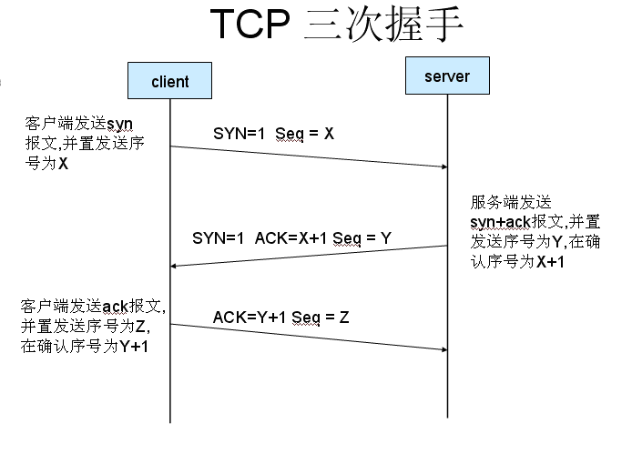
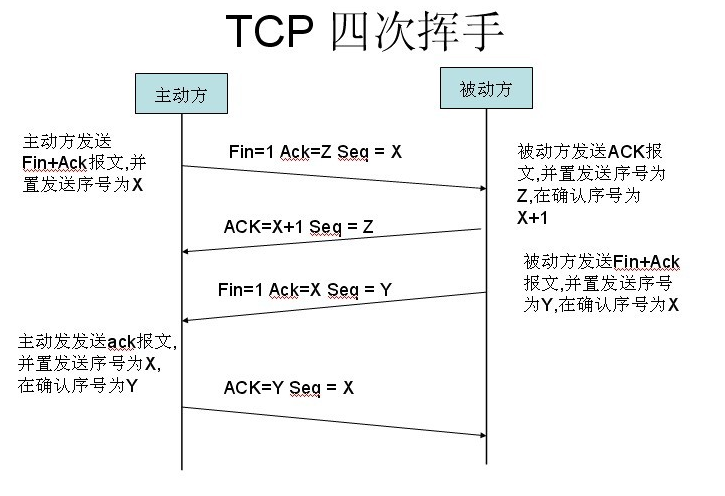

+ 从浏览器输入URL按回车到页面显示都发生了什么?
    - 浏览器根据URL进行DNS查询IP
        * 首先查询缓存DNS(浏览器缓存DNS)
        * 系统缓存DNS 
        * 路由器缓存DNS
        * ISP DNS缓存
        * 递归搜索
    - 应用层解析DNS域名
    - 取得IP地址,建立TCP连接(应用层发送http请求)
    - 构造HTTP请求
        * 添加HTTP首部
        * 根据同源策略,添加cookie
    - 在TCP连接,发送HTTP请求
        * SSL/TLS安全传输协议
> 它是位于传输层之上的一个安全套接层也就是https中的’s’，确保了（1）所有信息都是加密传播的，第三方无法窃听（2）具有校验机制，一旦被篡改，通信双方会立刻发现（3）配备身份证书，防止身份被发现。为网络通信提供安全保障。
        
        * 传输层用TCP协议传输报文
> 位于传输层的TCP协议为传输报文提供可靠的字节流服务。它为了方便传输，将大块的数据分割成以报文段为单位的数据包，并为他们编号，方便服务器接收时能正确的快速还原报文信息。TCP协议通过三次握手来建立连接，通过四次挥手断开连接，保证了传输的安全可靠，下面的两张图和那后地解释了三次握手和四次挥手。

    - 网络层IP协议查询MAC地址
> IP协议的作用是把TCP分割好的各种数据包传送给接收方，这时就需要接收方的MAC 地址，也就是物理地址。IP地址和MAC地址是一一对应的关系，一个网络设备的IP地址可以更换，但是MAC地址一般是固定不变的。ARP协议可以将IP地址解析成对应的MAC地址。当通信的双方不在同一个局域网时，需要多次中转才能到达最终的目标，在中转的过程中需要通过下一个中转站的MAC地址来搜索下一个中转目标，路由提供这种中转服务。

    - 数据到达数据链路层被处理包装
> 在找到对方的MAC地址后，就将数据发送到数据链路层，数据链路层负责三件事：封装成帧，透明传输，差错检测。

    - 物理层传输到达服务器端
> 数据进入物理层到达服务器后，再经历3-7的相反操作：在链路层接收到数据包，再层层向上直到应用层。这过程中包括在运输层通过TCP协议将分段的数据包重新组成原来的HTTP请求报文。

    - 服务器响应
> 服务接收到客户端发送的HTTP请求后，查找客户端请求的资源，并返回响应报文，响应报文中包括一个重要的信息——状态码。状态码由三位数字组成，其中比较常见的是200 OK表示请求成功。301表示永久重定向，即请求的资源已经永久转移到新的位置。在返回301状态码的同时，响应报文也会附带重定向的url，客户端接收到后将http请求的url做相应的改变再重新发送。
    
    - 客户端接收响应并渲染页面
> 服务器的响应到达客户端后，浏览器会根据接收到的数据渲染页面。 
