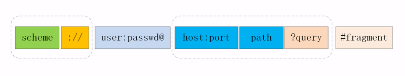

# http

+ 请求方法
    - OPTION : 用于获取资源支持的所有 HTTP 方法
    - HEAD : 用于只获取请求某个资源返回的头信息
    - GET : 用于从服务器获取资源信息
    - POST : 用于创建新资源
    - PUT : 用于完整的替换资源或者创建指定身份的资源
    - DELETE : 用于删除某个资源
    - PATCH : 用于局部更新资源
    - CONNECT : 请求连接转换到TCP/TP通道
+ 状态码
    + 请求成功
        - 200 : 求执行成功并返回相应数据
        - 201 : 创建成功并返回相应资源数据
        - 202 : 接受请求，但无法立即完成创建行为
        - 204 : 请求执行成功，不返回相应资源数据
    + 重定向
        - 301 : 被请求的资源已永久移动到新位置
        - 302 : 请求的资源现在临时从不同的 URI 响应请求
        - 303 : 对应当前请求的响应可以在另一个 URI 上被找到，客户端应该使用 GET 方法进行请求
        - 307 : 对应当前请求的响应可以在另一个 URI 上被找到，客户端应该保持原有的请求方法进行请求
    + 条件请求
        - 304 : 资源自从上次请求后没有再次发生变化，主要使用场景在于实现数据缓存
        - 409 : 请求操作和资源的当前状态存在冲突。主要使用场景在于实现并发控制
        - 412 : 服务器在验证在请求的头字段中给出先决条件时，没能满足其中的一个或多个。主要使用场景在于实现并发控制

    + 客户端错误
        - 400 : 请求体包含语法错误
        - 401 : 需要验证用户身份
        - 403 : 服务器拒绝执行
        - 404 : 找不到目标资源
        - 405 : 不允许执行目标方法，响应中应该带有 Allow 头，内容为对该资源有效的 HTTP 方法
        - 406 : 服务器不支持客户端请求的内容格式
        - 410 : 被请求的资源已被删除
        - 413 : POST 或者 PUT 请求的消息实体过大
        - 415 : 服务器不支持请求中提交的数据的格式
        - 422 : 请求格式正确，但是由于含有语义错误，无法响应
        - 428 : 要求先决条件，如果想要请求能成功必须满足一些预设的条件要求先决条件，如果想要请求能成功必须满足一些预设的条件
    + 服务端错误
        - 500 : 服务器遇到了一个未曾预料的状况，导致了它无法完成对请求的处理
        - 502 : 作为网关或者代理工作的服务器尝试执行请求时，从上游服务器接收到无效的响应
        - 501 : 服务器不支持当前请求所需要的某个功能
        - 503 : 由于临时的服务器维护或者过载，服务器当前无法处理请求
    + 对于1xx的状态码，为信息状态码，100 为继续，表示确认，成功返回具体参数信息。
    + 对于2xx的状态码，200 表示正常返回信息，201表示请求成功并且服务器创建了新的资源，202表示服务器已接受请求，但尚未处理。
    + 对于3xx，重定向，301表示，请求的网页已永久移动到新位置，302表示，临时性重定向，303表示临时性重定向，且总是使用 GET 请求新的 URI。304表示，自从上次请求后，请求的网页未修改过。
    + 对于4xx，客户端错误，404，服务器无法理解请求的格式，客户端不应当尝试再次使用相同的内容发起请求，401，请求未授权，403，禁止访问，404，找不到如何与 URI 相匹配的资源。
    + 对于5xx，服务器错误，500，最常见的服务器端错误，503，服务器端暂时无法处理请求，可能是过载或维护。

+ Http 数据压缩
    - `Content-Encoding: gzip`
+ http-分块传输
    - `Content-Length:` chunked || number

---

## GET方式与POST区别
+ get重点在从服务器上获取资源，post重点在向服务器发送数据；
+ get传输数据是通过URL请求，以field（字段）= value的形式，置于URL后，并用"?"连接，多个请求数据间用"&"连接。post传输数据通过Http的post机制，将字段与对应值封存在请求实体中发送给服务器，这个过程对用户是不可见的
+ Get传输的数据量小，因为受URL长度限制，但效率较高；Post可以传输大量数据，所以上传文件时只能用Post方式；
+ get是不安全的，因为URL是可见的。post较get安全性较高；
+ get方式只能支持ASCII字符，向服务器传的中文字符可能会乱码。post支持标准字符集，可以正确传递中文字符。
+ POST请求不能被缓存, GET请求参数会被完整保留在浏览器历史记录里，而POST中的参数不会被保留。

## http特点与缺点
1. 特点
    1.1 灵活可扩展
    1.2 可靠传输
    1.3 无状态等
2. 缺点
    2.1 无状态
    2.2 明文传输
    2.3 对头阻塞问题

# url 
> URL统一资源定位符，URI，统一资源标识符。URI用于区分网络上不同的资源。 URI包含了URN和URL。 URL的结构：

> 协议名，登录主机的用户信息，主机名和端口，请求路径，查询参数，URI上定位资源内的一个锚点。

 
