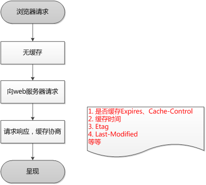

# 浏览器缓存

## 强缓存

- 强缓存：浏览器在加载资源时，先根据这个资源的一些 HTTP Header 判断是是否命中强缓存，强换成如果命中，浏览器直接从自己的缓存中读取资源，不会发送请求到服务器。

## 协商缓存

- 协商缓存： 当强缓存没有命中的时候，浏览器一定会发送一个强求到服务器，通过服务器端依据资源的另外一些 HTTP header 验证这个资源是否命中协商缓存，如果协商缓存命中，服务器就会将这个请求放回（304），但是不会返回这个资源的数据，而是告诉浏览器端可以直接从缓存中加载这个资源，于是浏览器就会从子的缓存中去加载这个资源。
- 若未命中请求，则将资源返回客户端，并更新本地缓存数据（200）
  > 强缓存不发送网络请求，协商缓存会发送网络请求。

## 浏览器缓存使用流程图：

- 第一次请求：
  

* 第二次请求：
  

---

## 强缓存

强缓存的设置方法主要是 Expires 和 Cache-control
Expires 是 HTTP1.0 提出的一个表示支援过期时间的 Header，它描述的是一个绝对时间，由服务器返回，用 GMT 格式的字符串表示

```
expires:Fri, 27 Aug 2027 00:00:00 GMT
```

由于是绝对时间，那么存在跨时区、系统时间有误等各种情况出现的误差，在 HTTP1.1 以后不在使用了。

cache-control 描述的是一个相对时间，在进行缓存命中的时候，都是利用客户端时间进行判断，所有相比较 Expires,cache-control 的缓存管理更有效，安全一些。

cache-control 可以的值有：public、no-cache、no-store、no-transform、must-revalidate、proxy-revalidate、max-age

1. 各个消息中的指令含义如下：
2. Public 指示响应可被任何缓存区缓存。
3. Private 指示对于单个用户的整个或部分响应消息，不能被共享缓存处理。这允许服务器仅仅描述当前用户的部分响应消息，此响应消息对于其他用户的请求无效。
4. no-cache 指示请求或响应消息不能缓存，该选项并不是说可以设置'不缓存'，而是需要和服务器确认
5. no-store 在请求消息中发送将使得请求和响应消息都不使用缓存，完全不存下來。
6. max-age 指示客户机可以接收生存期不大于指定时间（以秒为单位）的响应。
   上次缓存时间（客户端的）+max-age（64200s）<客户端当前时间
7. min-fresh 指示客户机可以接收响应时间小于当前时间加上指定时间的响应。
8. max-stale 指示客户机可以接收超出超时期间的响应消息。如果指定 max-stale 消息的值，那么客户机可以接收超出超时期指定值之内的响应消息。


> 注意：这两个 header 可以只启用一个，也可以同时启用，当 response header 中，Expires 和 Cache-Control 同时存在时，Cache-Control 优先级高于 Expires.

## 协商缓存

协商缓存主要由 Last-Modified/If-modified-Since 和 Etag/If-None-Match 实现

```
Last-Modified/If-Modified-Since：Last-Modified/If-Modified-Since要配合Cache-Control使用。
```

Last-Modified：标示这个响应资源的最后修改时间。服务器在响应请求时，告诉浏览器资源的最后修改时间。(放在响应头里面)
If-Modified-Since：当资源过期时（强缓存失效），发现资源具有 Last-Modified 声明，则再次向服务器请求时带上头 If-Modified-Since，表示请求时间。服务器收到请求后发现有头 If-Modified-Since 则与被请求资源的最后修改时间进行比对。若最后修改时间较新，说明资源又被改动过，则响应整片资源内容（写在响应消息包体内），HTTP 200；若最后修改时间较旧，说明资源无新修改，则响应 HTTP 304(无需包体，节省浏览)，告知浏览器继续使用所保存的 cache。（资源过期时放在请求头里面）

Etag/If-None-Match：Etag/If-None-Match 也要配合 Cache-Control 使用。
Etag：服务器响应请求时，告诉浏览器当前资源在服务器的唯一标识（生成规则由服务器决定）。

> Apache 中，ETag 的值，默认是对文件的索引节（INode），大小（Size）和最后修改时间（MTime）进行 Hash 后得到的。

If-None-Match：当资源过期时（使用 Cache-Control 标识的 max-age），发现资源具有 Etag 声明，则再次向服务器请求时带上头 If-None-Match （Etag 的值）。服务器收到请求后发现有头 If-None-Match 则与被请求资源的相应校验串进行比对，决定返回 200 或 304。
Etag 是服务器自动生成或者由开发者生成的对应资源在服务器端的唯一标识符，能够更加准确的控制缓存。


> Last-Modified 与 ETag 一起使用时，服务器会优先验证 ETag。

## 设置缓存的几种方法

1. meta 标签控制缓存（非 HTTP 协议定义）

```
<meta HTTP-EQUIV="cache-control" CONTENT="no-cache">
```

上诉代码的作用是告诉浏览器这个页面不被缓存，每次访问都需要去服务器拉取。这个方法使用简单，但是有部分浏览器不支持。而却缓存代理服务器都不支持，因此代理不解析 HTML 内容本身。

2. HTTP 头部控制缓存
   HTTP 头信息控制缓存是通过 Expires（强缓存）、Cache-control（强缓存）、last-Modified/If-Modified-Since(协商缓存)、Etag/If-None-Match(协商缓存)实现
