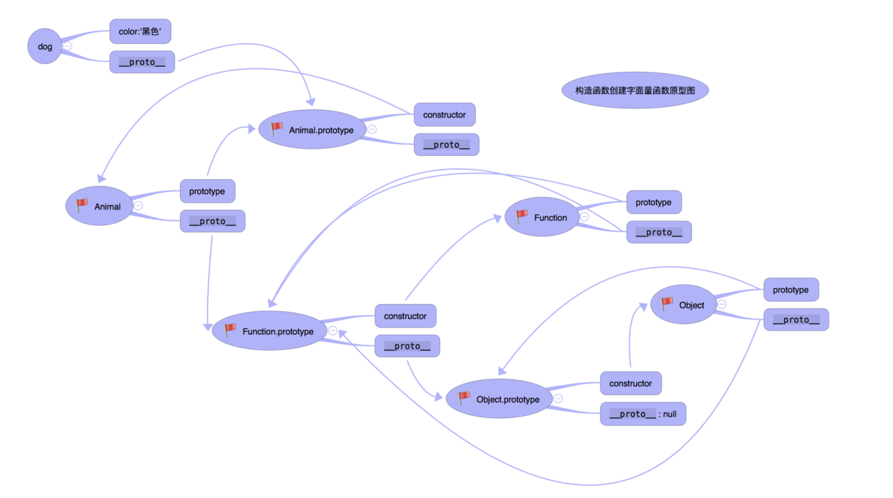
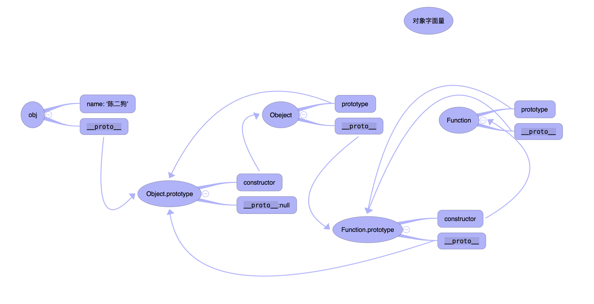
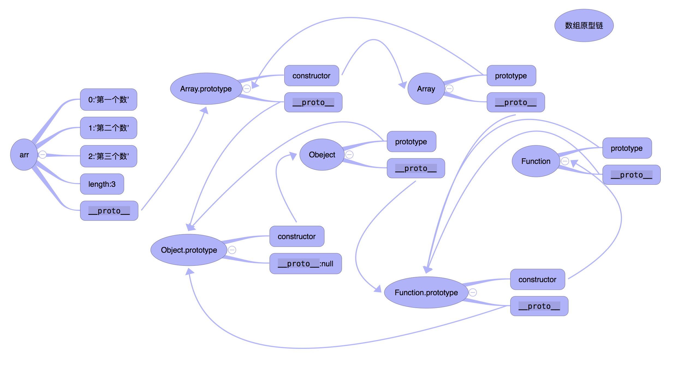
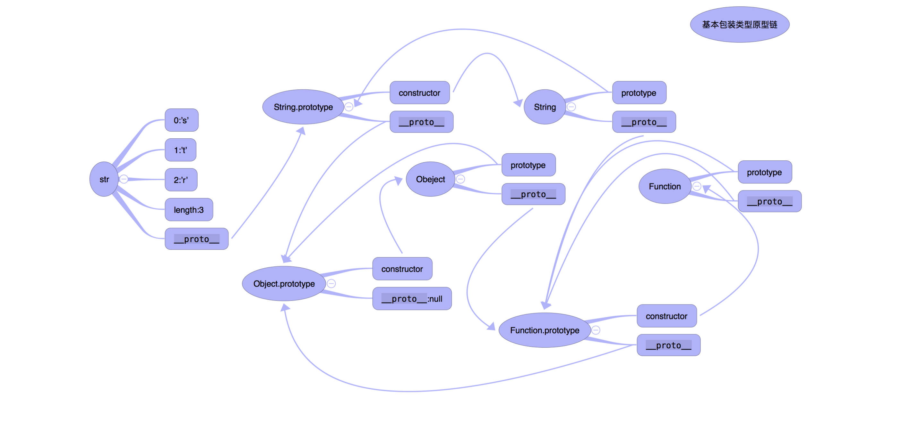

# 理解原型对象

## JavaScript高级程序设计
```
无论什么时候，只要创建一个新函数，就会根据一组特定的规则为该函数创建一个prototype属性,这个属性指向函数的原型对象。
在默认的情况下,所有的原型对象都会自动获得一个constructor(构造函数)属性,这个属性包含一个包含一个指向prototype属性所在函数的指针。
```

## 你不知道的JavaScript
```
JavaScript中的对象有一个特殊的[[Prototype]]内置属性，其实就是对于其他对象的引用。几乎所有的对象在创建时[[Prototype]]属性都会被赋予一个非空的值。

```

* 任何对象都拥有`__proto__`(隐式原型)属性,一般指向他们的构造函数的原型(prototype)
```
var a = new Array();

a.__proto__ === Array.prototype
```
* 原型链的顶端是Object.prototype,其`__proto__` 为null。也可以理解为：除了`Object.prototype`所有的对象都有原型。
```
Object.prototype.__proto__ === null;
```
* 所有的函数都拥有prototype(显式原型)属性
```
任何函数的 prototype.__proto__ 都指向 Object.prototype
```
* 所有的函数都是Function的实例
```
function abc(){
    alert(1)
};

abc.__proto__ === Function.prototype

var obj={},var arr=[];
obj.__proto__ === Object.prototype;
arr.__proto__ === Array.prototype;
```
* 更奇葩的来了，Object Function Array 本身也都是一个函数，由于是最常用的，所以JavaScript帮我们实现了

```
Function.__proto__ === Function.prototype;
Object.__proto__ === Function.prototype;
Array.__proto__ === Function.prototype;
```

* 原型对象中又拥有constructor属性,该属性指向函数本身,这个好理解


```
Function.prototype.constructor === Function;
Object.prototype.constructor === Object;
Array.prototype.constructor === Array

```

* 原型链
> 如果想要找到一个对象的属性,首先会先在自身查找,如果没有,就会通过__proto__属性一层层的向上查找,直到原型链的顶端 Object.prototype(__proto__: null）见第2这种通过某种纽带(__proto__)将对象之间形成一种继承关系 这种关系呈现出一种链条的形状 将这种链条称之为原型链

> 现在我们知道了，[[Prototype]]机制就是存在于对象中的一个内部链接，它会引用其他对象。

>通常来说，这个链接的作用是：如果在对象上没有找到需要的属性或者方法引用，引擎就会继续在[[Prototype]]关联的对象上进行查找。同理，如果在后者中也没有找到需要的引用就会继续查找它的[[Prototype]]，以此类推。这一系列对象的链接被称为“原型链”。


* 根据constructor推论出：

```
console.log(fn.constructor===Function); // true 
// 解析: 
// fn自身并没有constructor属性,所以他会顺着原型链向上找
// fn.__proto__ 指向的是 Function.prototype 见第4
// Function.prototype.constructor  === Function
console.log(Function.constructor === Function); // true
console.log(Object.constructor === Function);   //true
```


* Function.prototype.__proto__ === Object.prototype

> Function是一个特殊的例子 他创造了所有的函数,但他自身就是也是一个函数 总不能自己创造自己吧 所以他的上级是 Object.prototype


### 构造函数创建对象字面量原型图；
```
  function Animal (color) {
    this.color = color
}
var dog =  new Animal ('黑色')
```



### 完整对象字面量原型图:

```
var obj = { name: '陈二狗' } 
```




### 数组原型链

```
var arr = ['第一个数','第二个数','第三个数']
```


### 基本包装类型原型链
```
var str  = new String('str')  // var str = 'str'
```



## 深浅拷贝
>浅拷贝:对与数组和对象，浅拷贝更像是复制对象。一方改动另一方会体现出来。实现方法：如果是数组，我们可以利用数组的一些方法比如：slice、concat 返回一个新数组的特性来实现拷贝。

>深拷贝：就是指完全的拷贝一个对象，即使嵌套了对象，两者也相互分离，修改一个对象的属性，也不会影响另一个。 实现：

```
var deepCopy = function(obj) {
    if (typeof obj !== 'object') return;
    var newObj = obj instanceof Array ? [] : {};
    for (var key in obj) {
        if (obj.hasOwnProperty(key)) {
            newObj[key] = typeof obj[key] === 'object' ? deepCopy(obj[key]) : obj[key];
        }
    }
    return newObj;
}
```
### 性能问题
>尽管使用深拷贝会完全的克隆一个新对象，不会产生副作用，但是深拷贝因为使用递归，性能会不如浅拷贝，在开发中，还是要根据实际情况进行选择。