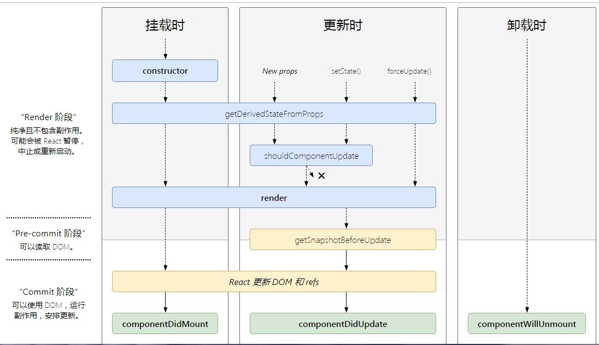

## React
### JSX
```
JavaScript 语法扩展
Babel 会把 JSX 转译成一个名为 React.createElement() 函数调用
```

### 生命周期

+ 挂载
  - render()
  - constructor()
  - componentDidMount()
+ 更新
  * shouldComponentUpdate()
  * render()
  * componentDidUpdate()
+ 卸载
  * componentWillUnMount()
+ 卸载
  * componentDidCatch()

### 其他
+ React 列表组件中添加Key作用?
  * key是给每一个vnode的唯一id,可以依靠key,更准确, 更快的拿到oldVnode中对应的vnode节点。
  * 因为带key就不是就地复用了，在sameNode函数 a.key === b.key对比中可以避免就地复用的情况。所以会更加准确。
  * 利用key的唯一性生成map对象来获取对应节点，比遍历方式更快。(这个观点，就是我最初的那个观点。从这个角度看，map会比遍历更快。)