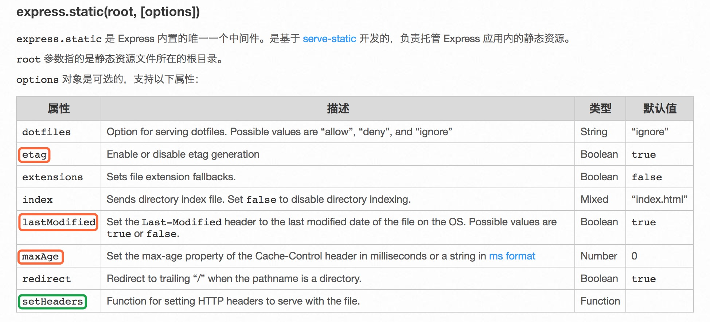

## 前端性能优化
+ 减少HTTP请求
    - CSS/JS 合并打包
    - 图标使用ICON或者雪碧图
    - 减少图片体积使用新图片格式webp或者base64格式图片
+ 减少静态资源的体积
    - 压缩CSS/JS、图片的体积
    - 编写高效率的CSS
    - 服务段开启gzip压缩
+ 使用缓存
    - 设置Http Header里面缓存相关的字段，做进一步的优化。

    - 可以设置etag、maxAge等，进一步会有200缓存和304缓存的区别：
```
200 OK (from cache) 是浏览器没有跟服务器确认，直接用了浏览器缓存；而 304 Not Modified 是浏览器和服务器多确认了一次缓存的有效性，然后再使用的缓存。
```