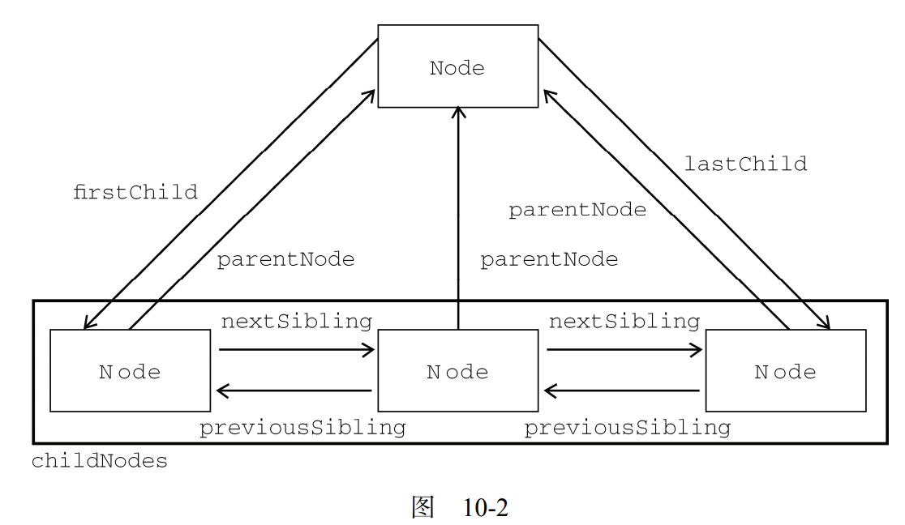

# DOM

## 节点
* html元素：根元素： 文档元素
+ nodeType
    - html  1
    - document 9
    - Text 3
    - Comment 8
    - DocumentType 10 //就是document.doctype
    - DocumentFragment 11 //文档片段。不懂
    - Attr 2 //特性
    + XML
        - CDATASection //类型只针对基于 XML 的文档，表示的是 CDATA 区域。与 Comment 类似，CDATASection 类型继承自 Text 类型，因此拥有除 splitText()[分割文本节点的方法](#Element)之外的所有字符串操作方法
        -   
* nodeName
* nodeValue

* 每个节点都有一个 childNodes 属性，保存这NodeList对象。  
* 每个节点都有一个 parentNode 属性，该属性指向文档树中的父节点。包含在 childNodes 列表中的所有节点都具有相同的父节点，因此它们的 parentNode 属性都指向同一个节点
* 包含在childNodes 列表中的每个节点相互之间都是同胞节点。通过使用列表中每个节点的 previousSibling和 nextSibling 属性，可以访问同一列表中的其他节点。列表中第一个节点的 previousSibling 属性值为 null，而列表中最后一个节点的 nextSibling 属性的值同样也为 null
* 如果childNodes列表中只有一个节点，那么该节点的 nextSibling 和 previousSibling 都为 null。
* 父节点与其第一个和最后一个子节点之间也存在特殊关系。父节点的 firstChild 和 lastChild 属性分别指向其 childNodes 列表中的第一个和最后一个节点。

* hasChildNodes()  :这个方法在节点包含一或多个子节点的情况下返回 true
> 这是比查询 childNodes列表的 length 属性更简单的方法。

* 所有节点都有的最后一个属性是 ownerDocument，该属性指向表示整个文档的文档节点

## 操作节点

* appendChild() ： 用于想childNodes列表末尾添加一个节点。
> 添加节点后，childNodes 的新增节点、父节点及以前的最后一个子节点的关系指针都会相应地得到更新。更新完成后，appendChild()返回新增的节点。

> 如果传入到 appendChild()中的节点已经是文档的一部分了，那结果就是将该节点从原来的位置转移到新位置。即使可以将 DOM 树看成是由一系列指针连接起来的，但任何 DOM 节点也不能同时出现在文档中的多个位置上。因此，如果在调用 appendChild()时传入了父节点的第一个子节点，那么该节点就会成为父节点的最后一个子节点.

* insertBefore() :这个方法接受两个参数：要插入的节点和作为参照的节点。插入节点后，被插入的节点会变成参照节点的前一个同胞节点（previousSibling），同时被方法返回。如果参照节点是null，则 insertBefore()与 appendChild()执行相同的操作

* replaceChild() :方法接受的两个参数是：要插入的节点和要替换的节点。要替换的节点将由这个方法返回并从文档树中被移除，同时由要插入的节点占据其位置。

> 在使用 replaceChild()插入一个节点时，该节点的所有关系指针都会从被它替换的节点复制过来。尽管从技术上讲，被替换的节点仍然还在文档中，但它在文档中已经没有了自己的位置。

* removeChild() : 一个参数，要移除的节点。

> 与使用 replaceChild()方法一样，通过 removeChild()移除的节点仍然为文档所有，只不过在文档中已经没有了自己的位置。

* cloneNode() : 二个布尔值的参数。
> 在参数为 true的情况下，执行深复制，也就是复制节点及其整个子节点树

> 在参数为 false 的情况下，执行浅复制，即只复制节点本身。复制后返回的节点副本属于文档所有，但并没有为它指定父节点。因此，这个节点副本就成为了一个“孤儿”，除非通过 appendChild()、insertBefore()或 replaceChild()将它添加到文档中。

## Document类型

* document.documentElement == document.firstChild == document.childNodes[0] //chrome true firefox false
* document.body  //body
* document.doctype  ////取得对<!DOCTYPE>的引用
+ 文档信息
    - document.title
    - document.URL
    - document.domain  //可以设置
    - document.referrer 
        - 来源信息
        - 类似于上一页 history.go(-1)
        - 类似于可以获取跳转页面来源于哪里：搜索引擎，直接输入(值是NULL)
+ 查找元素
    - getElementById()
    - getElementsByTagName() //这个方法会返回带有给定 name 特性的所有元素

+ 特殊集合
    - document.anchors
        - 包含文档中所有带 name 特性的&lt;/a&gt;元素
    - document.forms
        -   包含文档中所有的&lt;form&gt;元素 与 document.getElementsByTagName("form")得到的结果相同
    - document.images
        - 包含文档中所有的&lt;img&gt;元素 与  document.getElementsByTagName("form")得到的结果相同
    - document.links
        - 包含文档中所有带 href 特性的&lt;/a&gt;元素
 
### 文档写入
* document.write()  //一个参数，写入到输出的文档中。
* document.writeln() //一个参数，写入到输出的文档中。最后加上一个换行符。
* document.open()
* document.close()

### Element
#### 取得特性
* getAttribute()
* serAttribute()
* removeAttribute()

* document.createElement("标签名") //创建元素节点
* document.createTextNode("内容文本") //创建文本节点
> 合并二个相邻的文本节点normalize()：用处不大

> 分割一个文件节点的方法：splitText()  //参数不确定。

* document.createComment("注释内容") //创建注释节点
* document.createAttribute("特性")  //创建特性节点。。没啥用吧。。。。

## DOM 操作
* table的方法单独写吧。 不写了吧。

